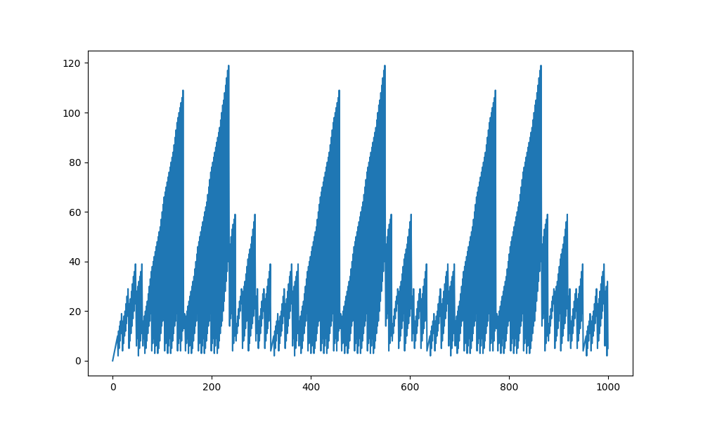
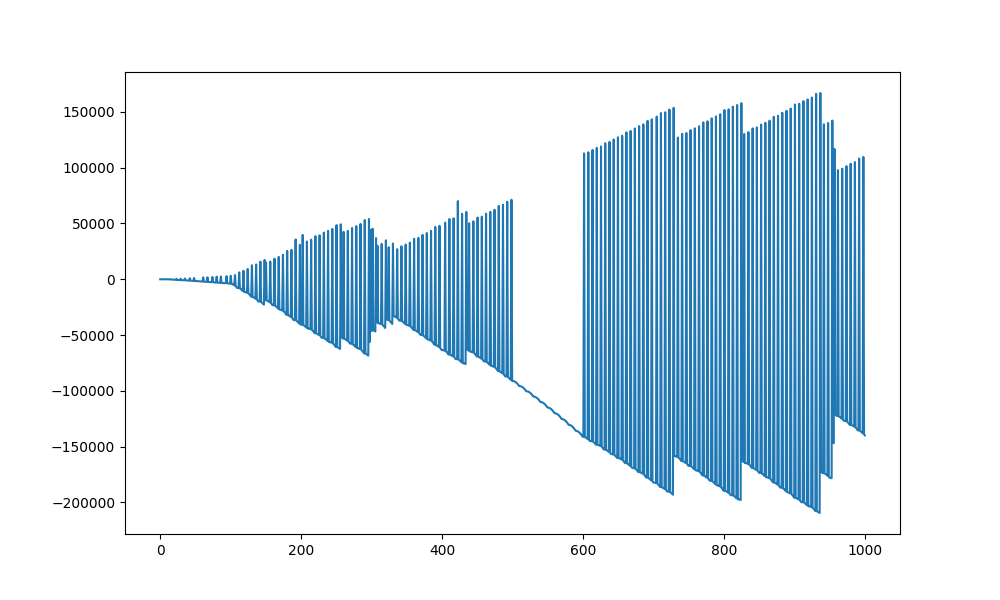
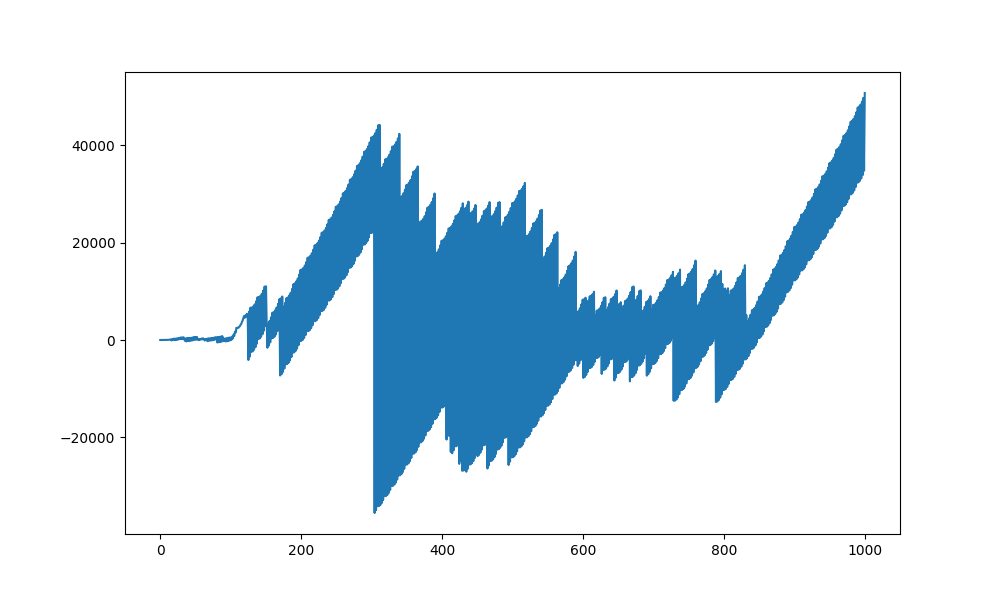
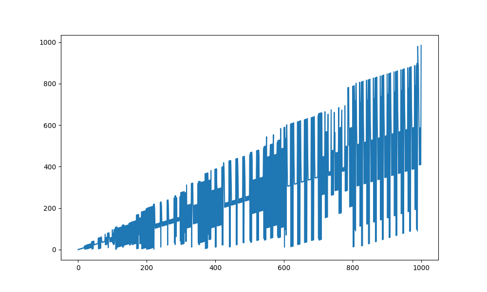
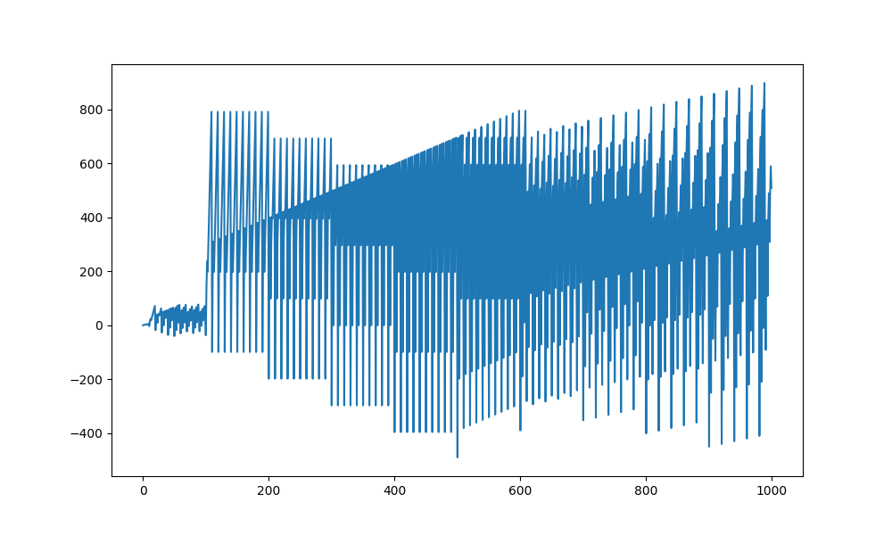
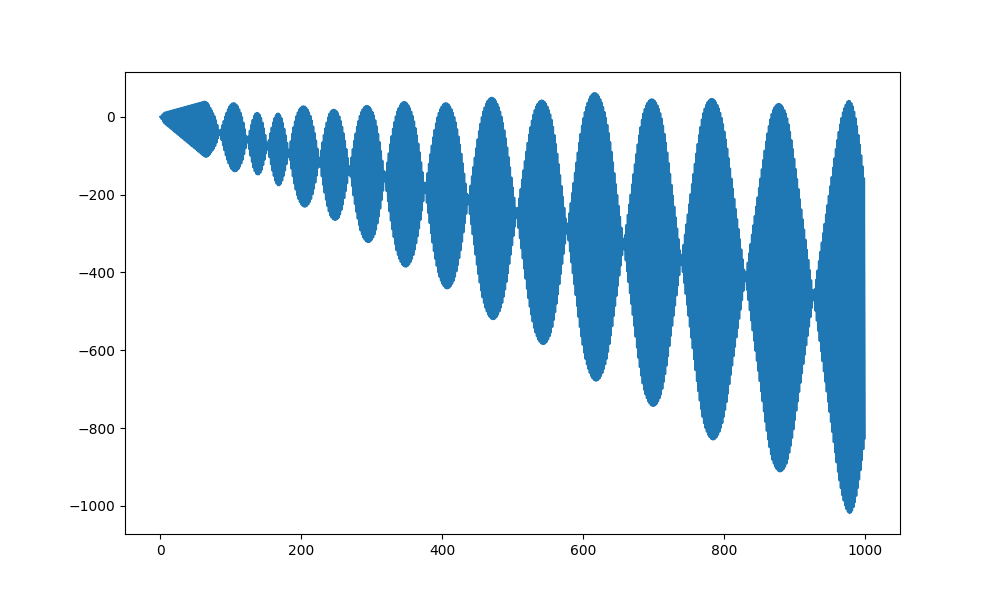

<div align="center">
  
   
  
</div>
<div align="center">
  
   
  
</div>

<div align="center">(Apparently) novel sequences!</div>


# LLM Math Scientist


For now, this is project is just a CLI for automatically generating novel sequence formulas and plotting them. LLMs will be added later to generate sequence ideas and judge them. You can set parameters and search for new recursive sequences, and quickly look at 100s of plots to find interesting ones!

## Explanation of sequence generation

To randomly generate a recursive formula, we have a pre-defined set of operations possible, and a certain set of possible values for those operations to operate on (specifically, those values are "n", "a(n-1)", "a(n-2)" etc depending on what num_prev_terms is which is a parameter). Once we know the possible abstract values we can choose from, we randomly choose num_values_tot of them, which is another parameter. We then randomly choose unary, binary, or ternary operations and iteratively apply them to a random set of our num_values_tot values until there is only one value. This then defines our random sequence formula. 

We then plot this, save the plot as a png, and save a semi-readable LaTeX pdf of the formula itself.

## Installation

1. Clone this repository:
   ```
   git clone https://github.com/jackaldenryan/llm-math-scientist.git
   cd llm-math-scientist
   ```

2. Install the required dependencies:
   ```
   pip install -r requirements.txt
   ```

## Usage

The CLI provides two main commands: `generate` and `plot`.

### Generate Multiple Sequences

To generate multiple sequences:

```
python cli.py generate [OPTIONS]
```

Options:
- `--n_terms INTEGER`: Number of terms in each sequence (default: 300)
- `--num_prev_terms INTEGER`: Number of previous terms to consider (default: 3)
- `--num_values_tot INTEGER`: Number of values to use in the generated formula (default: 10)
- `--num_random_seeds INTEGER`: Number of random seeds to use (default: 100)

Example:
```
python cli.py generate --n_terms 500 --num_random_seeds 50
```

This command will generate 50 sequences, each with 500 terms, and save them in the `sequences` folder.

### Plot Individual Sequence

To plot an individual sequence:

```
python cli.py plot [OPTIONS]
```

Options:
- `--n_terms INTEGER`: Number of terms in the sequence (default: 300)
- `--random_seed INTEGER`: Random seed for the sequence (default: 31)
- `--num_prev_terms INTEGER`: Number of previous terms to consider (default: 3)
- `--num_values_tot INTEGER`: Number of values to use in the generated formula (default: 10)

Example:
```
python cli.py plot --n_terms 1000 --random_seed 42
```

This command will generate and plot a single sequence with 1000 terms, using a random seed of 42, and save the plot in the "sequences/single_plots" folder. This can be used to plot more terms of any interesting-looking sequences found from the generate command.


## TODOs

* Generate sequences using LLM generated ideas
* Automatically find beautiful/interesting sequence plots using a vision model or multimodal LLM
* Add more operations (and handle automatic avoidance of things like divide by zero)
* Expand search space in other ways:
    * If-else rules, e.g. Collatz Conjecture
    * a(n) is the smallest number such that some property holds over all terms up to a(n) (forest fire sequence)
